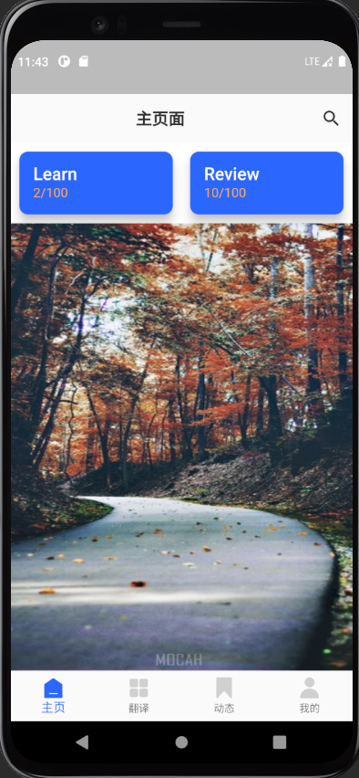
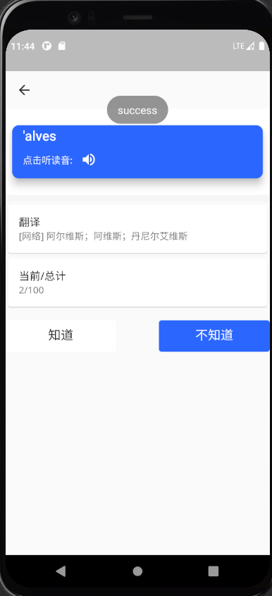
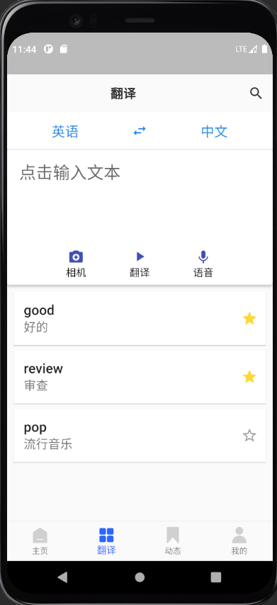
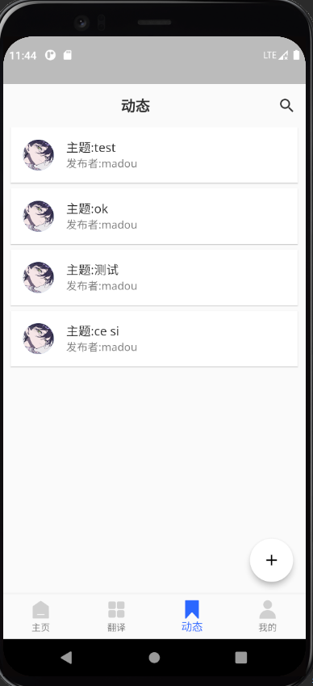
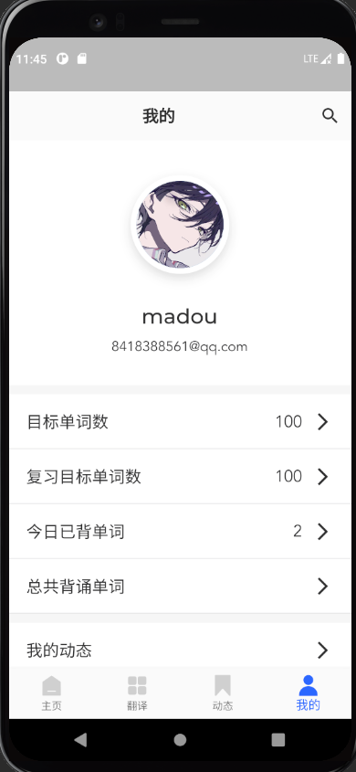

# 不记单词-移动端项目

GeEnglish：

移动端：Flutter框架

后端：Python Flask

## 项目地址
前端地址在分支 [GeEnglish项目](https://github.com/2017IOTrepo/EnglishManFlutter)

## 借鉴项目
* [EnglishManFlutter项目](https://github.com/2017IOTrepo/EnglishManFlutter)

## 项目展示

移动端界面

## 目前完成进度
1. 移动端界面完成
2. 后端管理界面完成
3. 前后端联调完成
4. 移动端界面优化未完成
5. 后端服务使用Redis缓存未完成
6. 单词遗忘算法帮助复习单词

## 补充
1. 移动端界面是使用[EnglishManFlutter项目](https://github.com/lotawei/new_flutter_mallprovider)
   项目，自己补充和修改了一些bug和适配flutter3的问题，在基础上增加了复习单词界面。
2. 后端的使用Python的Flask框架搭建，并加入了复习功能，使用了遗忘模型算法帮助用户有效的复习单词。
3. 管理端的后端和前端由我自己开发完成，后续会加入缓存优化项目。
4. 本项目从开发到完成1.0版本用时（12.25-1.5）
